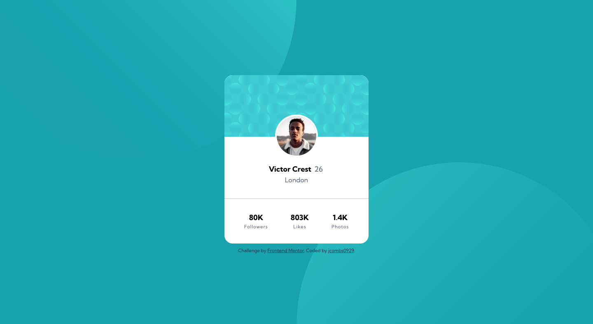

# Frontend Mentor - Profile card component solution

This is a solution to the [Profile card component challenge on Frontend Mentor](https://www.frontendmentor.io/challenges/profile-card-component-cfArpWshJ). Frontend Mentor challenges help you improve your coding skills by building realistic projects.

## Table of contents

- [Overview](#overview)
  - [The challenge](#the-challenge)
  - [Screenshot](#screenshot)
  - [Links](#links)
  - [Built with](#built-with)
- [Author](#author)

## Overview

### The challenge

Replicate static designs using any means you choose. I used flexbox for this exercise.

### Screenshot

### Links

- Solution URL: [Solution](https://www.frontendmentor.io/solutions/profile-card-flexbox-B93FC___z)
- Live Site URL: [Live Site](https://infallible-austin-7ff7da.netlify.app/)

### Built with

- Semantic HTML5 markup
- SCSS
- Flexbox

## Author

- Frontend Mentor - [@jcombs0929](https://www.frontendmentor.io/profile/jcombs0929)
